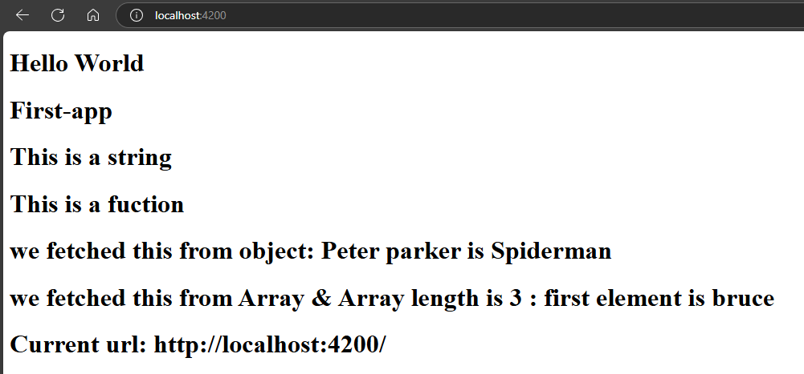

In JavaScript, interpolation usually refers to inserting variables or expressions inside strings using template literals (backticks `).  
In JavaScript, interpolation usually refers to inserting variables or expressions inside strings using template literals (backticks `).  

## `app.component.ts`:  
```typescript
import { Component } from '@angular/core';

@Component({
  selector: 'app-root',
  templateUrl: './app.component.html',
  styleUrls: ['./app.component.scss']
})
export class AppComponent {

  // All Interpolation Variable are here

  title = 'First-app';

  stringVar = "This is a string";

  functionName(){
    return "This is a fuction";
  }

  obj = {
    name: "Peter parker",
    heroName: "Spiderman"
  }

  arr = ["bruce", "clark", "diana"];

  siteUrl = window.location.href;
}
```  
## `app.component.html`:  
```
<!-- All Interpolation -->
<h1>Hello World</h1>
<h1>{{title}}</h1>
<h1>{{stringVar}}</h1>
<h1>{{functionName()}}</h1>
<h1>we fetched this from object: {{obj.name}} is {{obj.heroName}}</h1>
<h1>we fetched this from Array & Array length is {{arr.length}} : first element is {{arr[0]}}</h1>
<h1>Current url: {{siteUrl}}</h1>
```  
##### Preview:  
  