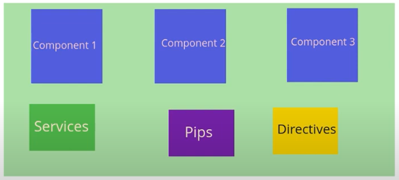

A module in Angular is a container that groups related components, directives, pipes, and services together.  
It helps Angular know how to organize and load parts of your app.   
##### Preview:  
  

Every Angular app must have at least one module — the root module — usually called:  
`app.module.ts` which will have this inside it  
```typescript
import { NgModule } from '@angular/core';
import { BrowserModule } from '@angular/platform-browser';
import { AppComponent } from './app.component';
import { MyComponent } from './my-component/my-component.component';

@NgModule({
  declarations: [ AppComponent, MyComponent ], // What components belong to this module
  imports: [ BrowserModule ],                  // What other modules this one uses
  bootstrap: [ AppComponent ]                  // The root component to launch the app
})
export class AppModule { }
```  

## Why modules:  
`Organize your app`: Split your app into feature modules, so it's easier to manage.  
`Control what’s available`:Modules can export and import only what’s needed — this keeps your app clean and optimized.  
`Enable lazy loading`: Feature modules can be lazy-loaded to improve performance.  

## Key Properties in a Module

| Property     | Purpose                                         |
|--------------|-------------------------------------------------|
| `declarations` | Components, directives, and pipes that belong to this module |
| `imports`      | Other modules that this module depends on     |
| `providers`    | Services that should be available app-wide or module-wide |
| `bootstrap`    | The main component that starts the app (only in root module) |

---

## Types of Modules

| Module Type     | Description                            |
|------------------|----------------------------------------|
| **Root Module**   | The main app module (usually `AppModule`) |
| **Feature Module**| Used to split your app into features   |
| **Shared Module** | Contains common components/pipes to reuse |
| **Core Module**   | Holds singleton services, app-wide providers |

---  
