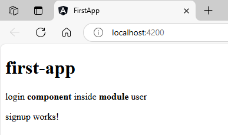

1. `create module`  
### Syntax  
```sh
ng generate module module-name        # Generate a module
ng g c module-name                    # Shortcut for module
```  
### Example  
```sh
ng g m users
```  
which will create a `.ts` file like this  
`src\app\users\users.module.ts`  
```typescript
import { NgModule } from '@angular/core';
import { CommonModule } from '@angular/common';

@NgModule({
  declarations: [],
  imports: [
    CommonModule
  ]
})
export class UsersModule { }
```  
2. `insert component inside module`  
### Syntax  
```sh
ng g c module-name/component-name
```  
### Example  
```sh
ng g c users/login
```  
this will create a component inside a module & automatically get injected inside it.  
`src\app\users\users.module.ts`  
```typescript
import { NgModule } from '@angular/core';
import { CommonModule } from '@angular/common';
import { LoginComponent } from './login/login.component';

@NgModule({
  declarations: [
    LoginComponent // component automatically injected inside this module because of CLI    
  ],
  imports: [
    CommonModule
  ]
})
export class UsersModule { }
```  
although it component is declared inside a module automatically, to use it outside we need to export it manually  
`src\app\users\users.module.ts`  
```ts
import { NgModule } from '@angular/core';
import { CommonModule } from '@angular/common';
import { LoginComponent } from './login/login.component';

@NgModule({
  declarations: [
    LoginComponent
  ],
  imports: [
    CommonModule
  ],
  exports:[  // need to make export array manually
    LoginComponent
  ]
})
export class UsersModule { }
```  
then we use it in main `app.module.ts`  
1. import statement  
2. import module inside array  
3. use component selector inside markup tags at desired HTML file (here `app.component.html`)    
`src\app\app.module.ts`  
```typescript
import { NgModule } from '@angular/core';
import { BrowserModule } from '@angular/platform-browser';

import { AppRoutingModule } from './app-routing.module';
import { AppComponent } from './app.component';
import { UsersModule } from './users/users.module'; // *

@NgModule({
  declarations: [
    AppComponent,
  ],
  imports: [
    BrowserModule,
    AppRoutingModule,
    UsersModule  // *
  ],
  providers: [],
  bootstrap: [AppComponent]
})
export class AppModule { }
```  
`src\app\app.component.html`  
```html
<h1>{{title}}</h1>
<app-login></app-login>
```  
##### Preview:  
  
## if you import module once, after that when you create multiple components inside that module, you can directly write those component selector markup in HTML, just export that component from that very own module  