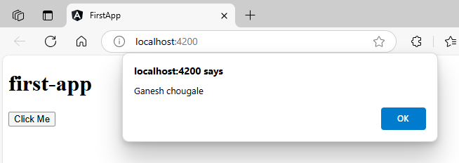
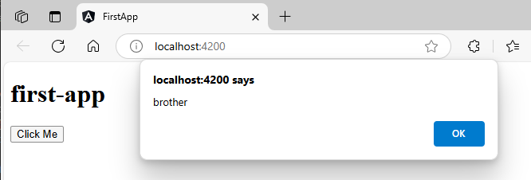

How to call a fuction in Angular  
1. Define a function
2. Make button and call function on button click
3. Pass params with function call  

`Note`: if we want a function call on button, both function call & button suppose to be in same component.  
here we will be using default `app` component  

1. write function in components `.ts` file without function keyword.  
`src\app\app.component.ts`:  
```typescript
import { Component } from '@angular/core';

@Component({
  selector: 'app-root',
  templateUrl: './app.component.html',
  styleUrls: ['./app.component.scss']
})
export class AppComponent {

  title = 'first-app';

  getName(){ // 🔄: here (Function without function keyword)
    alert("Ganesh chougale");
  }
  
}
```  
2. Add button & assign the function to click.  
`src\app\app.component.html`:  
```html
<h1>{{title}}</h1>
<button (click)="getName()">Click Me</button>
```  
##### Preview:  
  

3. pass parameters  
`src\app\app.component.ts`:  
```typescript
import { Component } from '@angular/core';

@Component({
  selector: 'app-root',
  templateUrl: './app.component.html',
  styleUrls: ['./app.component.scss']
})
export class AppComponent {

  title = 'first-app';

  getName(yourName: string){ // 🔄: here
    alert(yourName);
  }
  
}
```  
`src\app\app.component.html`:  
```html
<h1>{{title}}</h1>
<button (click)="getName('brother')">Click Me</button>
```  
##### Preview:  
  
4. pass parameters using variable  
`src\app\app.component.ts`:  
```typescript
import { Component } from '@angular/core';

@Component({
  selector: 'app-root',
  templateUrl: './app.component.html',
  styleUrls: ['./app.component.scss']
})
export class AppComponent {

  title = 'first-app';

  yourname = "Ganesh Chougale" // 🔄: here
  getName(params: string){ 
    alert(params);
  }
  
}
```  
`src\app\app.component.html`:  
```html
<h1>{{title}}</h1>
<button (click)="getName(yourname)">Click Me</button>
```  
##### Preview:  
  
