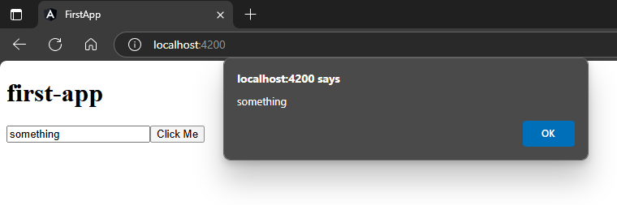

## Pass a value from an input field  
`src\app\app.component.ts`:  
```typescript
import { Component } from '@angular/core';

@Component({
  selector: 'app-root',
  templateUrl: './app.component.html',
  styleUrls: ['./app.component.scss']
})
export class AppComponent {

  title = 'first-app';

  getName(params: string){ // 🔄: here
    alert(params);
  }
}
```  
`src\app\app.component.html`:  
```html
<h1>{{title}}</h1>
<input type="text" #nameInput />
<button (click)="getName(nameInput.value)">Click Me</button>
```  
##### Preview:  
  
