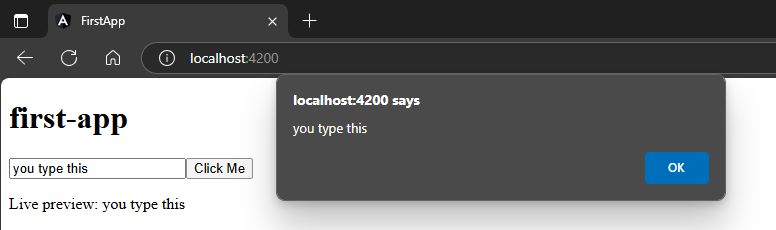

## with 2-way binding if needed  
`src\app\app.module.ts`  
```typescript
import { NgModule } from '@angular/core';
import { BrowserModule } from '@angular/platform-browser';

import { AppRoutingModule } from './app-routing.module';
import { AppComponent } from './app.component';
import { FormsModule } from '@angular/forms';

@NgModule({
  declarations: [
    AppComponent,
  ],
  imports: [
    BrowserModule,
    AppRoutingModule,
    FormsModule // 🔄: imported here
  ],
  providers: [],
  bootstrap: [AppComponent]
})
export class AppModule { }
```  
`src\app\app.component.ts`  
```typescript
import { Component } from '@angular/core';

@Component({
  selector: 'app-root',
  templateUrl: './app.component.html',
  styleUrls: ['./app.component.scss']
})
export class AppComponent {

  title = 'first-app';
  
  myString: string = ''; // 🔄: here
  getName(params: string){ 
    alert(params);
  }
}
```  
`src\app\app.component.html`  
```html
<h1>{{title}}</h1>
<input [(ngModel)]="myString" />
<button (click)="getName(myString)">Click Me</button>
<p>Live preview: {{ myString }}</p>
```  
##### Preview:  
  

[(ngModel)] enables two-way data binding between your template and component  
You must import FormsModule to use it  
It combines:  
[value]="yourVariable" (from component to template)  
(input)="yourVariable = $event.target.value" (from template to component)  