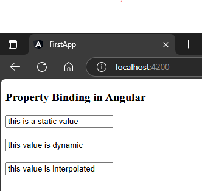
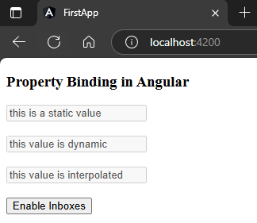
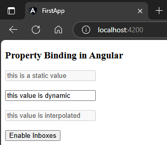

`Property Binding` vs `Interpolation`  
1. Preview  
`app.component.html`  
```html
<h3>Property Binding in Angular</h3>
<input type="text" value="this is a static value">
<br><br>
<input type="text" [value] ="bindedValue">
<br><br>
<input type="text" value={{inpterPolatedValue}}>
```  
`app.component.ts`  
```typescript
import { Component } from '@angular/core';

@Component({
  selector: 'app-root',
  templateUrl: './app.component.html',
  styleUrls: ['./app.component.scss']
})
export class AppComponent {
  bindedValue = "this value is dynamic"
  inpterPolatedValue = "this value is interpolated"
} 
```  
##### Preview:  
  
2. Difference   
to see difference we will disable the inboxes.  
`app.component.html`  
```html
<h3>Property Binding in Angular</h3>
<input type="text" disabled value="this is a static value">
<br><br>
<input type="text" [disabled]="isDisabled"  [value] ="bindedValue">
<br><br>
<input type="text" disabled="{{isDisabled}}" value={{inpterPolatedValue}}>
<br><br>
<button (click)="enabler()">Enable Inboxes</button>
```  
`app.component.ts` 
```typescript
import { Component } from '@angular/core';

@Component({
  selector: 'app-root',
  templateUrl: './app.component.html',
  styleUrls: ['./app.component.scss']
})
export class AppComponent {
  bindedValue = "this value is dynamic"
  inpterPolatedValue = "this value is interpolated"

  isDisabled = true;
  enabler(){
    this.isDisabled = false;
  }
  
} 
```  
1. this is just regular input box so here we didn't do anything on it.  
2. property binded input box, this will work dynamically & can remove disable from the input box.  
3. interpolated input box wont remove disabled from itself.  
### Before button click 
##### Preview:  
    
### After button click 
##### Preview:  
    