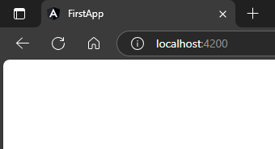

## 1. Basic If  
`app.component.html`  
```html
<h3 *ngIf="show">If block</h3>
```    
if variable is false, it wont render  
`app.component.ts`  
```typescript
import { Component } from '@angular/core';

@Component({
  selector: 'app-root',
  templateUrl: './app.component.html',
  styleUrls: ['./app.component.scss']
})
export class AppComponent {
  show = false // 🔄 will not render
} 
```  
##### Preview:  
  
if variable is true, it will render  
`app.component.ts`  
```typescript
import { Component } from '@angular/core';

@Component({
  selector: 'app-root',
  templateUrl: './app.component.html',
  styleUrls: ['./app.component.scss']
})
export class AppComponent {
  show = true // 🔄 will render
} 
```  
  

## 2. Basic Else  
`app.component.html`  
```html
<h3 *ngIf="show else elseBlock">If block</h3>
<ng-template #elseBlock>
    <h1>Else block</h1>
</ng-template>
```  
`app.component.ts`  
```typescript
import { Component } from '@angular/core';

@Component({
  selector: 'app-root',
  templateUrl: './app.component.html',
  styleUrls: ['./app.component.scss']
})
export class AppComponent {
  show = false;
} 
```  
  

## 3. Basic ifElse based on string value  
`app.component.html`  
```html
<h3 *ngIf="show=='yes'; else elseBlock">If block</h3>
<ng-template #elseBlock>
    <h1>Else block</h1>
</ng-template>
```  
`app.component.ts`  
```typescript
import { Component } from '@angular/core';

@Component({
  selector: 'app-root',
  templateUrl: './app.component.html',
  styleUrls: ['./app.component.scss']
})
export class AppComponent {
  show = 'yes';
} 
```  
##### Preview:  
  

## 4. if else render with string  
`app.component.html`  
```html
<h3 *ngIf="show=='yes'; then ifBlock else elseBlock"></h3>
<ng-template #ifBlock>
    <h1>If block</h1>
</ng-template>
<ng-template #elseBlock>
    <h1>Else block</h1>
</ng-template>
```  
`app.component.ts`  
```typescript
import { Component } from '@angular/core';

@Component({
  selector: 'app-root',
  templateUrl: './app.component.html',
  styleUrls: ['./app.component.scss']
})
export class AppComponent {
  show = 'notYes';
} 
```  
##### Preview:  
##### Preview:  
  

## Note:  
do not write `*ngIf=""` condition directly in <ng-template> use other markups for this like  
```html
<h1></h1>
<ng-container></ng-container>
```  

## 5. if else using property bindings  
`app.component.ts`  
```typescript
import { Component } from '@angular/core';

@Component({
  selector: 'app-root',
  templateUrl: './app.component.html',
  styleUrls: ['./app.component.scss']
})
export class AppComponent {
  show = 'red';
} 
```  
`app.component.html`  
```html
<ng-template [ngIf]="show=='red'">
    <h2>Red</h2>
</ng-template>
<ng-template [ngIf]="show=='yellow'">
    <h2>Yellow</h2>
</ng-template>
<ng-template [ngIf]="show=='green'">
    <h2>Green</h2>
</ng-template>
```  
this will work with data binding condition  
##### Preview:  
  
but again use `<ng-container>` with `*ngIF` instead `<ng-template>` with [ngIf], because `<ng-container>` is a non-rendering container. It doesn’t add any DOM elements to the layout but works with Angular directives like *ngIf.  
`app.component.html`  
```html
  <ng-container *ngIf="show === 'red'">
    <h2>Red</h2>
  </ng-container>
  <ng-container *ngIf="show === 'yellow'">
    <h2>Yellow</h2>
  </ng-container>
  <ng-container *ngIf="show === 'green'">
    <h2>Green</h2>
  </ng-container>
```  