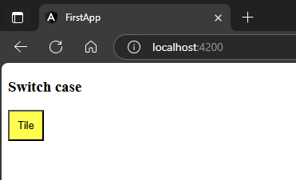

`app.component.html`  
```html
<h3>Switch case</h3>
  <div [ngSwitch]="color" >
    <button style="background-color: red; padding: 10px;"
    *ngSwitchCase="'red'">Tile</button>
    <button style="background-color: yellow; padding: 10px;"
    *ngSwitchCase="'yellow'">Tile</button>
    <button style="background-color: green; padding: 10px;"
    *ngSwitchCase="'green'">Tile</button>
  </div>
```  
`app.component.ts`  
```typescript
import { Component } from '@angular/core';

@Component({
  selector: 'app-root',
  templateUrl: './app.component.html',
  styleUrls: ['./app.component.scss']
})
export class AppComponent {
  color = 'yellow';
} 
```  
##### Preview:  
  