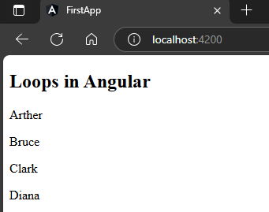
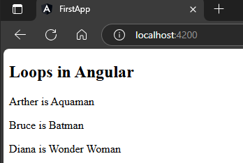
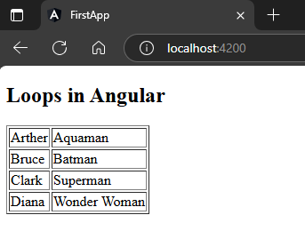

## 1. For loop on normal array  
`app.component.ts`  
```typescript
import { Component } from '@angular/core';

@Component({
  selector: 'app-root',
  templateUrl: './app.component.html',
  styleUrls: ['./app.component.scss']
})
export class AppComponent {
  myArr = ["Arther", "Bruce", "Clark", "Diana"];
} 
```  
`app.component.html`  
```html
<h2>Loops in Angular</h2>
<p *ngFor="let i of myArr">
{{i}}
</p>
```  
##### Preview:  
  

## 2. For loop on array of objects  
`app.component.ts`  
```typescript
import { Component } from '@angular/core';

@Component({
  selector: 'app-root',
  templateUrl: './app.component.html',
  styleUrls: ['./app.component.scss']
})
export class AppComponent {
  myArr = [
    {
      name: "Arther",
      character: "Aquaman"
    },
    {
      name: "Bruce",
      character: "Batman"
    },
    {
      name: "Diana",
      character: "Wonder Woman"
    }
  ];
} 
```  
`app.component.html`  
```html
<h2>Loops in Angular</h2>
<p *ngFor="let i of myArr">
    {{i.name}} is {{i.character}}
</p>
```  
##### Preview:  
  
## Or we can do it in tabular format also  
`app.component.ts`  
```typescript
import { Component } from '@angular/core';

@Component({
  selector: 'app-root',
  templateUrl: './app.component.html',
  styleUrls: ['./app.component.scss']
})
export class AppComponent {
  myArr = [
    {
      name: "Arther",
      character: "Aquaman"
    },
    {
      name: "Bruce",
      character: "Batman"
    },
    {
      name: "Clark",
      character: "Superman"
    },
    {
      name: "Diana",
      character: "Wonder Woman"
    },
  ];
} 
```  
`app.component.html`  
```html
<h2>Loops in Angular</h2>
<table border="1">
    <tr *ngFor="let i of myArr">
        <td>{{i.name}}</td>
        <td>{{i.character}}</td>
    </tr>
</table>
```  
##### Preview:  
  