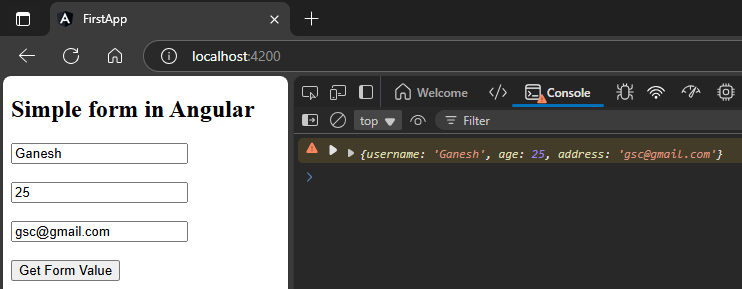

# Simple form & getting form value  
1. import form module from angular form  
```typescript
import { FormsModule } from '@angular/forms';
```  
& pass it into imports array  
```typescript
  imports: [
    BrowserModule,
    AppRoutingModule,
    FormsModule // 🔄: imported here
  ],
```  
whole snippet  
location: desired module   
`app.module.ts`  
```typescript
import { NgModule } from '@angular/core';
import { BrowserModule } from '@angular/platform-browser';

import { AppRoutingModule } from './app-routing.module';
import { AppComponent } from './app.component';
import { FormsModule } from '@angular/forms'; // 🔄: imported here

@NgModule({
  declarations: [
    AppComponent,
  ],
  imports: [
    BrowserModule,
    AppRoutingModule,
    FormsModule // 🔄: imported here
  ],
  providers: [],
  bootstrap: [AppComponent]
})
export class AppModule { }
```  
2. make a simple form  
`app.component.html`  
```html
<h2>Simple form in Angular</h2>
<form #simpleForm="ngForm" (ngSubmit)="getForm(simpleForm.value)" >
    <input type="text" ngModel name="username" placeholder="Enter your name">
    <br><br>
    <input type="number" ngModel name="age" placeholder="Enter your age">
    <br><br>
    <input type="text" ngModel name="address" placeholder="Enter your address">
    <br><br>
    <button>Get Form Value</button>
</form>
```  
`app.component.ts`  
```typescript
import { Component } from '@angular/core';

@Component({
  selector: 'app-root',
  templateUrl: './app.component.html',
  styleUrls: ['./app.component.scss']
})
export class AppComponent {
  getForm(para: any){
    console.warn(para)
  }
} 
```  
##### Preview:  
  