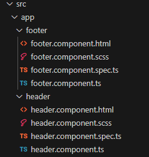
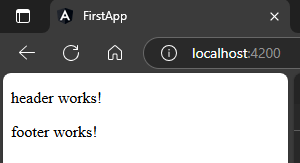
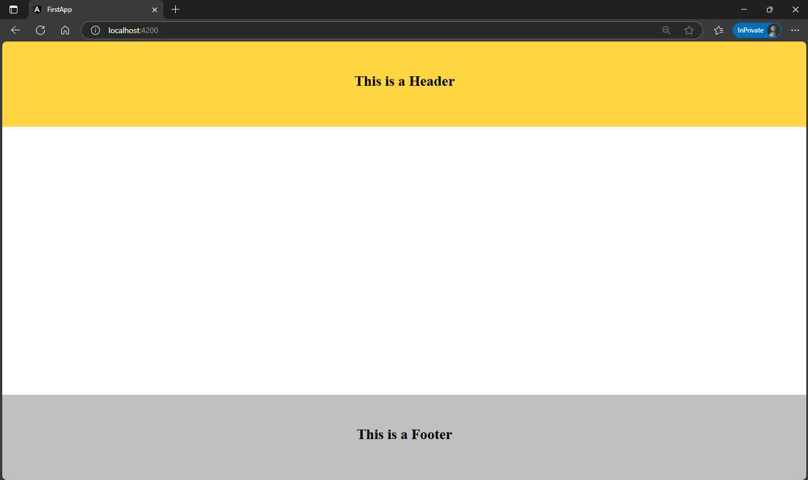

## 1. create Header & Footer component  
```sh
ng g c header
```  
```sh
ng g c footer
```  
##### Preview:  
  
## 2. use both selectors in parent html  
`app.component.html`  
```html
<app-header></app-header>
<app-footer></app-footer>
```  
##### Preview:  
  
## 3. Make changes in html accordingly  
`src\app\header\header.component.html`  
```html
<h1>This is a Header</h1>
```  
`src\app\footer\footer.component.html`  
```html
<h1>This is a Footer</h1>
```  
## 4. Give styling to each component  
`src\app\header\header.component.html`  
```scss
h1{
    background-color: gold;
    position: absolute;
    top: 0;
    width: 100%;
    margin: 0;
    padding: 70px 0;
    height: 50px;
    text-align: center;
}
```  
`src\app\footer\footer.component.html`  
```scss
h1{
    background-color: silver;
    position: absolute;
    bottom: 0;
    width: 100%;
    margin: 0;
    padding: 70px 0;
    height: 50px;
    text-align: center;
}
```  
## Apply global css if want  
`src\styles.scss`  
```scss
/* You can add global styles to this file, and also import other style files */
*{
    margin: 0;
    padding: 0;
}
```  
##### Preview:  
  