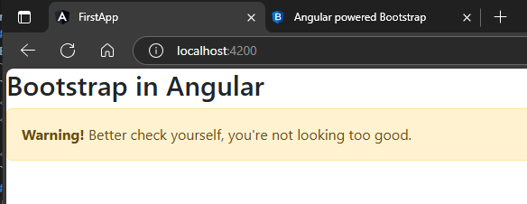

## 1.Istallation Command  
https://ng-bootstrap.github.io/#/home  
```sh
ng add @ng-bootstrap/ng-bootstrap
```  
restart your appliaction after bootstrap installation  
## 2. Grab any component from website & use it into markup
Example: basic Alert  
`app.component.html`  
```html
<h2>Bootstrap in Angular</h2>
<ngb-alert [dismissible]="false">
	<strong>Warning!</strong> Better check yourself, you're not looking too good.
</ngb-alert>
```  
##### Preview:  
  

### OR, grab some advance snippets like closable alerts  
`app.component.html`  
```html
<h2>Bootstrap in Angular</h2>

<ngb-alert *ngFor="let alert of alerts; trackBy: trackByAlert"
           [type]="alert.type"
           (closed)="close(alert)">
  {{ alert.message }}
</ngb-alert>

<button type="button" class="btn btn-primary" (click)="reset()">Reset</button>
```    

`app.component.ts`  
```typescript
import { Component } from '@angular/core';

interface Alert {
	type: string;
	message: string;
}

const ALERTS: Alert[] = [
	{
		type: 'success',
		message: 'This is an success alert',
	},
	{
		type: 'info',
		message: 'This is an info alert',
	},
	{
		type: 'warning',
		message: 'This is a warning alert',
	},
	{
		type: 'danger',
		message: 'This is a danger alert',
	},
	{
		type: 'primary',
		message: 'This is a primary alert',
	},
	{
		type: 'secondary',
		message: 'This is a secondary alert',
	},
	{
		type: 'light',
		message: 'This is a light alert',
	},
	{
		type: 'dark',
		message: 'This is a dark alert',
	},
];


@Component({
  selector: 'app-root',
  templateUrl: './app.component.html',
  styleUrls: ['./app.component.scss']
})
export class AppComponent {

  trackByAlert(index: number, alert: Alert): string {
    return alert.message;
  }
  
	// alerts!: Alert[];
	alerts: Alert[] = [];

	constructor() {
		this.reset();
	}

	close(alert: Alert) {
		this.alerts.splice(this.alerts.indexOf(alert), 1);
	}

	reset() {
		this.alerts = Array.from(ALERTS);
	}

} 
```  
<!-- Both of snippet of closable ALert needed error solvings, by dafault are not working becuase of version issues -->