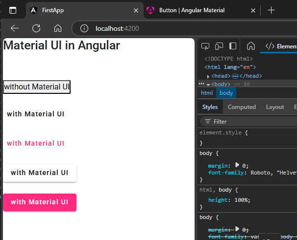

## 1. Command to install Material UI  
https://material.angular.io/  
```sh
ng add @angular/material
```  
Choose Default theme: `Indigo/Pink`  
Set up global Angular typography styles: `N`  
Choose Default animation choice  


restart your appliaction after installation  
## 2. import the stuff you want to use in module  
example:   
```typescript
import { MatButtonModule } from '@angular/material/button';full snippet  

```  
full snippet  
`src\app\app.module.ts`  
```typescript
import { NgModule } from '@angular/core';
import { BrowserModule } from '@angular/platform-browser';

import { AppRoutingModule } from './app-routing.module';
import { AppComponent } from './app.component';
import { FormsModule } from '@angular/forms';
import { NgbModule } from '@ng-bootstrap/ng-bootstrap';
import { BrowserAnimationsModule } from '@angular/platform-browser/animations';

import { MatButtonModule } from '@angular/material/button'; // 🔄: imported here

@NgModule({
  declarations: [
    AppComponent,

  ],
  imports: [
    BrowserModule,
    AppRoutingModule,
    FormsModule,
    NgbModule,
    BrowserAnimationsModule,
    MatButtonModule // 🔄: imported here
  ],
  providers: [],
  bootstrap: [AppComponent]
})
export class AppModule { }
```  

## 3. Add snippets from official UIs  
```typescript
<h2>Material UI in Angular</h2>
<br><br>
<button>without Material UI</button>
<br><br>
<button mat-button >with Material UI</button>
<br><br>
<button mat-button color="accent">with Material UI</button>
<br><br>
<button mat-raised-button >with Material UI</button>
<br><br>
<button mat-raised-button color="accent">with Material UI</button>
```  
##### Preview:  
  
you can another stuff too like slider, button toggle, card etc..  