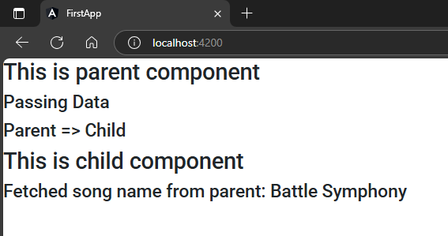

## 1. Make a child component, here `user`  
```sh
ng g c user
```  
& use its selector in parent components markup  
## 2. create a property inside a Parent component to pass  
`app.component.ts`  
```typescript
import { Component } from '@angular/core';

@Component({
  selector: 'app-root',
  templateUrl: './app.component.html',
  styleUrls: ['./app.component.scss']
})
export class AppComponent {
  songName = "Battle Symphony";
} 
```  
## 3. Pass it to child via attribute binding  
`app.component.html`  
```html
<h2>This is parent component</h2>
<h4>Passing Data</h4>
<h4>Parent => Child</h4>

<app-user [fromParent]="songName"></app-user>
```  
## 4. use this variable in child component  
`user.component.ts`  
```typescript
import { Component, Input } from '@angular/core';

@Component({
  selector: 'app-user',
  templateUrl: './user.component.html',
  styleUrls: ['./user.component.scss']
})
export class UserComponent {
  // @Input() fromParent! : string
  @Input() fromParent : string = "";
}
```  
`user.component.html`  
```html
<h2>This is child component</h2>
<h4>Fetched song name from parent: {{fromParent}}</h4>
```  
##### Preview:  
  