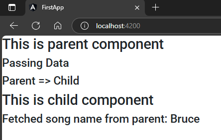

## 1. Create a object inside parent  
`app.component.ts`  
```typescript
import { Component } from '@angular/core';

@Component({
  selector: 'app-root',
  templateUrl: './app.component.html',
  styleUrls: ['./app.component.scss']
})
export class AppComponent {
  obj = {
    name: "Bruce",
    address: "Gotham"
  }
} 
```  
## 2. Passing object to child  
`app.component.html`  
```html
<h2>This is parent component</h2>
<h4>Passing Data</h4>
<h4>Parent => Child</h4>

<app-user [fromParent]="obj"></app-user>
```  
## 3. Accessing it in child component
`user.component.ts`  
```typescript
import { Component, Input } from '@angular/core';

@Component({
  selector: 'app-user',
  templateUrl: './user.component.html',
  styleUrls: ['./user.component.scss']
})
export class UserComponent {
  @Input() fromParent : any;
}
```  
## 4. Using it into child markup  
`user.component.html`  
```html
<h2>This is child component</h2>
<h4>Fetched song name from parent: {{fromParent.name}}</h4>
```  
##### Preview:  
  