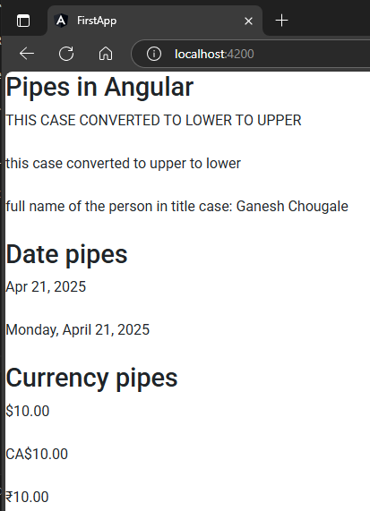

src\app\app.component.ts
```ts
import { Component } from '@angular/core';

@Component({
  selector: 'app-root',
  templateUrl: './app.component.html',
  styleUrls: ['./app.component.scss']
})
export class AppComponent {

  person = {
    fName: "ganesh",
    lName: "chougale"
  }

  today = Date.now();

  value = 10
} 
```  
src\app\app.component.html
```html
<h2>Pipes in Angular</h2>
<br><br>
{{"this case converted to lower to upper" | uppercase}}
<br><br>
{{"THIS CASE CONVERTED TO UPPER TO LOWER" | lowercase}}
<br><br>
{{"full name of the person in title case: " + (person.fName + " " + person.lName | titlecase)}}
<br><br>
<h2>Date pipes</h2>
{{today | date}}
<br><br>
{{today | date:"fullDate"}}
<br><br>
<h2>Currency pipes</h2>
{{value | currency:"USD"}}
<br><br>
{{value | currency:"CAD"}}
<br><br>
{{value | currency:"INR"}}
<br><br>
```  

##### Preview:  
   