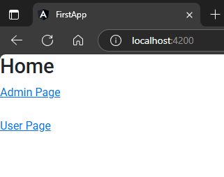
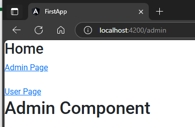
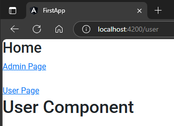
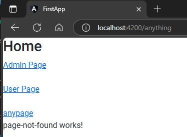

## 1. create two component  
```sh
ng g c admin
```  
```sh
ng g c user
```  

## 2. create objects of component in route array  
`src\app\app-routing.module.ts`  
```typescript
import { NgModule } from '@angular/core';
import { RouterModule, Routes } from '@angular/router';
// 🔄: import component here
import { UserComponent } from './user/user.component';
import { AdminComponent } from './admin/admin.component';

const routes: Routes = [  // 🔄: add routing objects here
  { path:"admin", component:AdminComponent},
  { path:"user", component:UserComponent}
];

@NgModule({
  imports: [RouterModule.forRoot(routes)],
  exports: [RouterModule]
})
export class AppRoutingModule { }
```  

## 3. add routing links in markup  
src\app\app.component.html
```html
<h2>Home</h2>

<a routerLink="admin">Admin Page</a>
<br><br>
<a routerLink="user">User Page</a>

<router-outlet></router-outlet> <!-- 🔄: this tag is crucial, to render changes on page -->
```   
##### Preview:  
  
##### Preview:  
  
##### Preview:  
  

## 4. Add 404 page  
it is considered as a best practice to add 404 page to routing just in case if things goes south  
```sh
ng g c page-not-found
```  
this component will act as our wildcard  
`src\app\app-routing.module.ts`  
```typescript
import { NgModule } from '@angular/core';
import { RouterModule, Routes } from '@angular/router';
import { UserComponent } from './user/user.component';
import { AdminComponent } from './admin/admin.component';
import { PageNotFoundComponent } from './page-not-found/page-not-found.component';  // 🔄: imported here

const routes: Routes = [
  { path:"admin", component:AdminComponent},
  { path:"user", component:UserComponent},
  { path:"**", component:PageNotFoundComponent}   // 🔄: ** mean we are using wildcard here.  
];

@NgModule({
  imports: [RouterModule.forRoot(routes)],
  exports: [RouterModule]
})
export class AppRoutingModule { }
```  
src\app\app.component.html
```html
<h2>Home</h2>

<a routerLink="admin">Admin Page</a>
<br><br>
<a routerLink="user">User Page</a>
<br><br>
<a routerLink="anything">anypage</a>

<router-outlet></router-outlet> <!-- 🔄: this tag is crucial, to render changes on page -->
```  
##### Preview:  
  