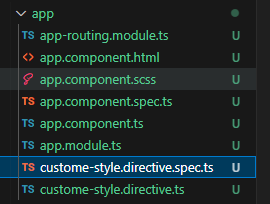
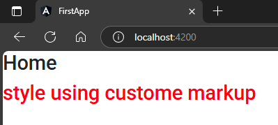

syntax:  
```sh
ng g directive directiveName
```  
when we run this command it creates 2 file, logic file & test file    
1. `name.directice.ts`  
2. `name.directice.spec.ts`  
then it get imported & added into `app.module.ts`    

## 1. Example:  
```sh
ng g directive custome-style
```  
src\app\app.component.ts
```typescript
import { NgModule } from '@angular/core';
import { BrowserModule } from '@angular/platform-browser';

import { AppRoutingModule } from './app-routing.module';
import { AppComponent } from './app.component';
import { FormsModule } from '@angular/forms';

import { CustomeStyleDirective } from './custome-style.directive';   // 🔄: imported

@NgModule({
  declarations: [
    AppComponent,
    CustomeStyleDirective,   // 🔄: added
  ],
  imports: [
    BrowserModule,
    AppRoutingModule,
    FormsModule,
  ],
  providers: [], 
  bootstrap: [AppComponent]
})
export class AppModule { }
```  
##### Preview:  
  

## 2. write your custom logic in your custome directive  
`src\app\custome-style.directive.ts`  
```typescript
import { Directive, ElementRef } from '@angular/core';    // 🔄: added element reference

@Directive({
  selector: '[appCustomeStyle]' // 🔄: use this selector name as attribute in markup
})
export class CustomeStyleDirective {

  constructor(private e: ElementRef) {    // 🔄: passed element reference as parameter
    e.nativeElement.style.color="red"
   }

}
```  
## 3. now use the selector of that custome directive as a attribute in markup template  
src\app\app.component.html
```html
<h2>Home</h2>
<h2 appCustomeStyle>style using custome markup</h2>
```  
##### Preview:  
  
we can use this custome directive as many time as we want  