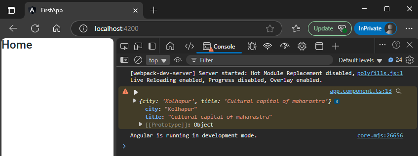
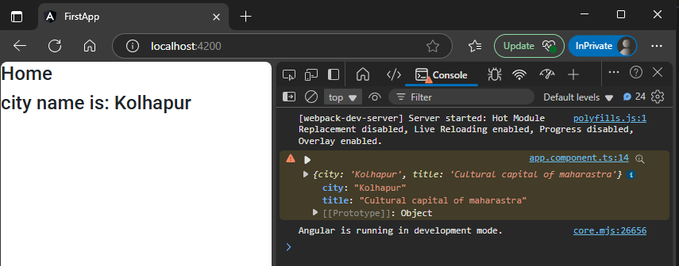

## 1. create service  
```sh
ng g service userData
```  
this will create 2 file   
1. `src\app\user-data.service.ts` : logic file
1. `src\app\user-data.service.spec.ts` : testing file  
after creation these file will be available globally throughout entire application. thats we dont need to import it into any module, just import into desired component & use it as much as you want  

## 2. write your logic here
`src\app\user-data.service.ts`:
```typescript
import { Injectable } from '@angular/core';

@Injectable({
  providedIn: 'root'   // this makes it a singleton
})
export class UserDataService {

  constructor() { }

  getData(){       // 🔄: created a custome function  
    return { city: "Kolhapur", title: "Cultural capital of maharastra"}
  }
}
```  

## 3. use it into component  
src\app\app.component.ts
```ts
import { Component } from '@angular/core';
import { UserDataService } from './user-data.service';

@Component({
  selector: 'app-root',
  templateUrl: './app.component.html',
  styleUrls: ['./app.component.scss']
})
export class AppComponent {

     // 🔄: create a constructor as a dependacny injection  
     constructor(private user:UserDataService){
      console.warn(this.user.getData())
     }
} 
```  
##### Preview:  
  

## this way we can access or show data  
`src\app\app.component.ts`
```ts
import { Component } from '@angular/core';
import { UserDataService } from './user-data.service';

@Component({
  selector: 'app-root',
  templateUrl: './app.component.html',
  styleUrls: ['./app.component.scss']
})
export class AppComponent {
    
  name="";
     // 🔄: create a constructor as a dependacny injection  
     constructor(private user:UserDataService){
      console.warn(this.user.getData())
      let data = this.user.getData();
      this.name = data.city;
     }
} 
```  
`src\app\app.component.html`
```html
<h2>Home</h2>
<h2>city name is: {{name}}</h2>
```  
##### Preview:  
  