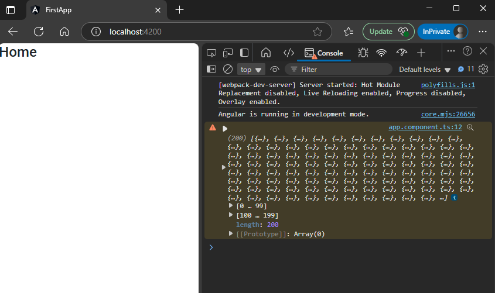

When we call a API, it always get called with service.  
why we need API?  
the thing is UI cannot interact with database directly, it need backend to interact with database. we built backend using node, python, java, C#.  

here right now we dont have APIs, so we will use open source APIs like  
`https://jsonplaceholder.typicode.com/todos`  
this  

1. `app.module.ts`(Module):  import `HttpClientModule` & add to imports array 
2. `user-service.service.ts`(Service): import `HttpClient` & pass it to constructor function as parameter, get API's http URL & perform business logic on it.  
3. `app.component.ts` (Component):  import `Service` , pass it to constructor function as parameter & perform action in the constructor  

## 1. create a service  
```sh
ng g service userService
```  

## 2. import `http` in module.  
`src\app\app.module.ts`
```ts
import { NgModule } from '@angular/core';
import { BrowserModule } from '@angular/platform-browser';
import { AppRoutingModule } from './app-routing.module';
import { AppComponent } from './app.component';

import { HttpClientModule } from "@angular/common/http";   // 🔄: imported http into module 

@NgModule({
  declarations: [
    AppComponent,
  ],
  imports: [
    BrowserModule,
    AppRoutingModule,

    HttpClientModule   // 🔄: add http to imports
  ],
  providers: [], 
  bootstrap: [AppComponent]
})
export class AppModule { }
```  

## 3. write logic in service according to API.  
`src\app\user-service.service.ts`  
```typescript
import { Injectable } from '@angular/core';
import { HttpClient } from "@angular/common/http"    // 🔄: imported http

@Injectable({
  providedIn: 'root'
})
export class UserServiceService {

  constructor(private http: HttpClient) { }    // 🔄: passed http as parameter in constructor

  getData(){
    let url = "https://jsonplaceholder.typicode.com/todos";
     return this.http.get(url);     // 🔄: used inbuilt get() method of http 
  }
}
```  

## 4. use API in component  
`src\app\app.component.ts`  
```ts
import { Component } from '@angular/core';
import { UserServiceService } from './user-service.service';    // 🔄: imported service into component


@Component({
  selector: 'app-root',
  templateUrl: './app.component.html',
  styleUrls: ['./app.component.scss']
})
export class AppComponent {
  constructor(private user: UserServiceService){
    this.user.getData().subscribe(data => console.warn(data))
  }

} 
```  
##### Preview:  
  
we will continue this where we will show this data not in console but in html table  
