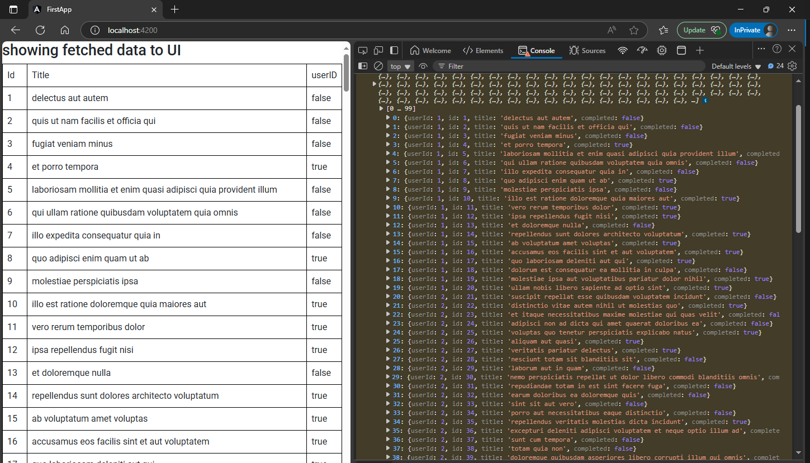

last steps  
1. `app.module.ts`(Module):  import `HttpClientModule` & add to imports array 
2. `user-service.service.ts`(Service): import `HttpClient` & pass it to constructor function as parameter, get API's http URL & perform business logic on it.  
3. `app.component.ts` (Component):  import `Service` , pass it to constructor function as parameter & perform action in the constructor  

now we will proceed to show this data into UI.  

1. `user-data.ts`(Interface): Create an interface based on object types  
2. `user-service.service.ts`(Service): apply interface in service  
3. `app.component.ts`(Component): show the entries using looping directive to UI  
4. `app.component.scss`(CSS): apply sutable CSS to component  

## 1. create an interface according to output object  
`src\app\Models\user-data.ts`  
```typescript
export interface UserData {
    id: number;
    title: string;
    userID: number;
    completed: boolean;
  }
```  
## 2. Apply interface to service  
`src\app\user-service.service.ts`  
```typescript
import { Injectable } from '@angular/core';
import { HttpClient } from "@angular/common/http"
import { UserData } from "./Models/user-data"    // 🔄: imported http
import { Observable } from 'rxjs';    // 🔄: imported Observable<T> from Reactive Extensions for JS

@Injectable({
  providedIn: 'root'
})
export class UserServiceService {

  constructor(private http: HttpClient) { }    // 🔄: passed http as parameter in constructor

  getData(): Observable<UserData[]> {
    let url = "https://jsonplaceholder.typicode.com/todos";
    return this.http.get<UserData[]>(url);
  }
}
```  
## 3. Apply API to UI  
`src\app\app.component.ts`  
```typescript
import { Component } from '@angular/core';
import { UserServiceService } from './user-service.service';
import { UserData } from './Models/user-data';


@Component({
  selector: 'app-root',
  templateUrl: './app.component.html',
  styleUrls: ['./app.component.scss']
})
export class AppComponent {
  data: UserData[] =[];
  constructor(private user: UserServiceService){
    this.user.getData().subscribe(data => {
      console.warn(data);
      this.data = data;
    })
  }
} 
```  

## 4. Apply Css to UI  
`src\app\app.component.scss`  
```scss
table {
    width: 100%;
    border-collapse: collapse;
  }
  
  td, th {
    border: 1px solid black;
    padding: 8px;
  }
  
```  
##### Preview:  
  