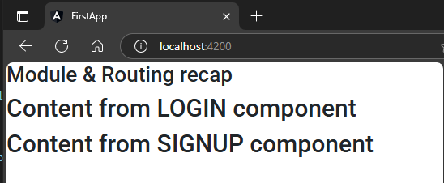
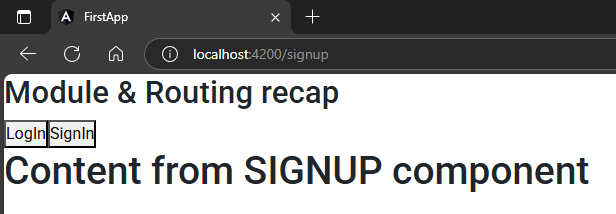

## 1. Module creation    
1. create module  
```sh
ng g m user
```  
2. create components inside module  
```sh
ng g c user/login
```  
```sh
ng g c user/signup
```  
3. Add those components to exporting array of current module  
`src\app\user\user.module.ts`  
```typescript
import { NgModule } from '@angular/core';
import { CommonModule } from '@angular/common';
import { LoginComponent } from './login/login.component';
import { SignupComponent } from './signup/signup.component';


@NgModule({
  declarations: [
    LoginComponent,
    SignupComponent
  ],
  imports: [
    CommonModule
  ],
  // 🔄: export all components to outer program  
  exports: [
    LoginComponent,
    SignupComponent
  ]
})
export class UserModule { }
```  
## 2. use component to UIs
1. import inner module to outer/main module & add it to imports array  
`src\app\app.module.ts`  
```typescript
import { NgModule } from '@angular/core';
import { BrowserModule } from '@angular/platform-browser';
import { AppRoutingModule } from './app-routing.module';
import { AppComponent } from './app.component';

import { UserModule } from './user/user.module'; // 🔄: here

UserModule

@NgModule({
  declarations: [
    AppComponent,
  ],
  imports: [
    BrowserModule,
    AppRoutingModule,
    UserModule            // 🔄: here
  ],
  providers: [], 
  bootstrap: [AppComponent]
})
export class AppModule { }
```  
2. use inner component selectors into outer components  
`src\app\app.component.html`  
```html
<h2>Module & Routing recap</h2>
<app-login></app-login>
<app-signup></app-signup>
```  
##### Preview:  
  

## 3. Define Routing  
1. import all component into routing file.  
`app.routing.module.ts`  
```typescript
import { NgModule } from '@angular/core';
import { RouterModule, Routes } from '@angular/router';

import { LoginComponent } from './user/login/login.component';
import { SignupComponent } from './user/signup/signup.component';

const routes: Routes = [
  {path: 'login', component: LoginComponent},
  {path: 'signup', component: SignupComponent},

];

@NgModule({
  imports: [RouterModule.forRoot(routes)],
  exports: [RouterModule]
})
export class AppRoutingModule { }
```  
2. update UI  
`app.component.html`  
```html
<h2>Module & Routing recap</h2>
<button routerLink="login">LogIn</button>
<button routerLink="signup">SignIn</button>
<router-outlet></router-outlet>
```  
##### Preview:  
  