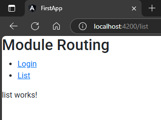

## 1. Initialize  
1. create module with routing file 
```sh
ng g m admin --routing
```  
`src\app\admin\admin-routing.module.ts`  
```typescript
import { NgModule } from '@angular/core';
import { RouterModule, Routes } from '@angular/router';

const routes: Routes = [];

@NgModule({
  imports: [RouterModule.forChild(routes)],
  exports: [RouterModule]
})_
export class AdminRoutingModule { }
```  
we can notice the difference that main route file (`app.routing.module.ts`) has `.forRoot()` method while any module routing file will have `.forChild()` method  

2. Create two component inside that module  
```sh
ng g c admin/login
ng g c admin/list
```  

## 2. Define routes in module file
before this we only defined routes only at `app.routing.component.ts`, now we can define routes within that very module  
1. import all component & state their paths into array inside current module  
`src\app\admin\admin-routing.module.ts`  
```typescript
import { NgModule } from '@angular/core';
import { RouterModule, Routes } from '@angular/router';

import { LoginComponent } from './login/login.component';   // 🔄
import { ListComponent } from './list/list.component';      // 🔄

const routes: Routes = [
  {path: "login", component: LoginComponent},   // 🔄
  {path: "list", component: ListComponent},     // 🔄
];

@NgModule({
  imports: [RouterModule.forChild(routes)],
  exports: [RouterModule]
})
export class AdminRoutingModule { }
```  

## 3. Define inner module into parent module  
`src\app\app.module.ts`  
```typescript
import { NgModule } from '@angular/core';
import { BrowserModule } from '@angular/platform-browser';
import { AppRoutingModule } from './app-routing.module';
import { AppComponent } from './app.component';

import { AdminModule } from './admin/admin.module';   // 🔄

@NgModule({
  declarations: [
    AppComponent,
  ],
  imports: [
    BrowserModule,
    AppRoutingModule,
    AdminModule       // 🔄
  ],
  providers: [], 
  bootstrap: [AppComponent]
})
export class AppModule { }
```  

## 4. now just write markup & use routers  
`app.component.html`  
```typescript
<h2>Module Routing</h2>
<ul>
    <li>
        <a routerLink="login">Login</a>
    </li>
    <li>
        <a routerLink="list">List</a>
    </li>
</ul>
<router-outlet></router-outlet>
```  
##### Preview:  
  