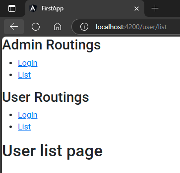

## 1. create module & components inside it  
lets quickly create a module & created 2 components inside it  
```sh
ng g m user --routing
```  
```sh
ng g c user/list
ng g c user/login
```  
`src\app\user\user-routing.module.ts`  
```typescript
import { NgModule } from '@angular/core';
import { RouterModule, Routes } from '@angular/router';

import { LoginComponent } from '../admin/login/login.component';  // 🔄
import { ListComponent } from './list/list.component';  // 🔄

const routes: Routes = [{    // 🔄: this time add prefix (user), then appended children on it  
    path:'user',children:[
      {path: "login", component: LoginComponent},
      {path: "list", component: ListComponent},
    ]}
];

@NgModule({
  imports: [RouterModule.forChild(routes)],
  exports: [RouterModule]
})
export class UserRoutingModule { }
```  
## 2. import module & add to imports array in main module  
`app.module.ts`  
```typescript
import { NgModule } from '@angular/core';
import { BrowserModule } from '@angular/platform-browser';
import { AppRoutingModule } from './app-routing.module';
import { AppComponent } from './app.component';

import { AdminModule } from './admin/admin.module';

import { UserModule } from './user/user.module';       // 🔄


@NgModule({
  declarations: [
    AppComponent,
  ],
  imports: [
    BrowserModule,
    AppRoutingModule,
    AdminModule,
    UserModule      // 🔄
  ],
  providers: [], 
  bootstrap: [AppComponent]
})
export class AppModule { }
```  

## 3. use grouped path in attribut at markup  
`src\app\app.component.html`  
example: 
admin/login  
or  
user/login  
```html
<h2>Admin Routings</h2>
<ul>
    <li>
        <a routerLink="admin/login">Login</a>
    </li>
    <li>
        <a routerLink="admin/list">List</a>
    </li>
</ul>

<h2>User Routings</h2>
<ul>
    <li>
        <a routerLink="user/login">Login</a>
    </li>
    <li>
        <a routerLink="user/list">List</a>
    </li>
</ul>
<router-outlet></router-outlet> 
```  
##### Preview:  
  