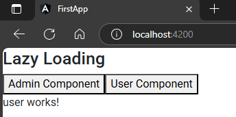

when we fetch data it load all at once  
Lazy loading is mechanism where it loads a specific data only when a specific requests hits  
it increase performance of application & reduce bulk  

## 1. creating 2 components  
```sh
ng g c admin
ng g c user
```  

## 2. Make markup  
`app.component.html`  
```html
<h3>Lazy Loading</h3>
<button (click)="loadAdmin()">Admin Component</button>
<button (click)="loadUser()">User Component</button>
```  

## 3. give onclick functionalities  
`app.component.ts`  
```typescript
import { Component } from '@angular/core';

import { ViewContainerRef } from '@angular/core';         // 🔄: create a container like DIV
import { ComponentFactoryResolver } from '@angular/core'; // 🔄: converts Dynamic code into component


@Component({
  selector: 'app-root',
  templateUrl: './app.component.html',
  styleUrls: ['./app.component.scss']
})
export class AppComponent {

  // 🔄: create a constructor
  constructor(private viewContainer:ViewContainerRef, private cfr: ComponentFactoryResolver){}

  // 🔄: functionality of onclick: painting component
  async loadAdmin(){
    this.viewContainer.clear();
    const { AdminComponent } = await import("./admin/admin.component");
    this.viewContainer.createComponent(this.cfr.resolveComponentFactory(AdminComponent));
  }
  async loadUser(){
    this.viewContainer.clear();
    const { UserComponent } = await import("./user/user.component");
    this.viewContainer.createComponent(this.cfr.resolveComponentFactory(UserComponent));
  }
 
} 
```  
this will load specific button when we click on specific button
##### Preview:  
  