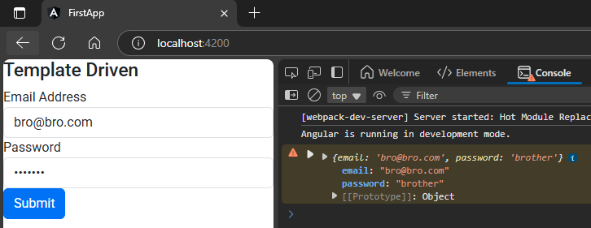

## 1. import `FormModule` & add it to imports array into `app.module.ts`  
```typescript
import { NgModule } from '@angular/core';
import { BrowserModule } from '@angular/platform-browser';
import { AppRoutingModule } from './app-routing.module';
import { AppComponent } from './app.component';

import { FormsModule } from '@angular/forms';   // 🔄: here


@NgModule({
  declarations: [
    AppComponent,
  ],
  imports: [
    BrowserModule,
    AppRoutingModule,
    FormsModule   // 🔄: here
  ],
  providers: [], 
  bootstrap: [AppComponent]
})
export class AppModule { }

```    

## 2. Define template/markup  
`app.component.html`  
```html
<h3>Template Driven</h3>


<div class="col-sm-6">
    <form #userForm="ngForm" (ngSubmit)="onSubmit(userForm.value)">
        <div class="form-group">
            <label for="inputEmail">Email Address</label>
            <input ngModel type="email" class="form-control" id="inputEmail" name="email">
        </div>
        <div class="form-group">
            <label for="inputPassword">Password</label>
            <input ngModel type="password" class="form-control" id="inputPassword" name="password">
        </div>
        <button type="submit" class="btn btn-primary">Submit</button>
    </form>
</div>
```  

## 3. Define onClick function  
`app.component.ts`  
```typescript
import { Component } from '@angular/core';

import { ViewContainerRef } from '@angular/core';         // 🔄: create a container like DIV
import { ComponentFactoryResolver } from '@angular/core'; // 🔄: converts Dynamic code into component


@Component({
  selector: 'app-root',
  templateUrl: './app.component.html',
  styleUrls: ['./app.component.scss']
})
export class AppComponent {
  onSubmit(data){
    console.warn(data)
  }

} 
```  
##### Preview:  
  