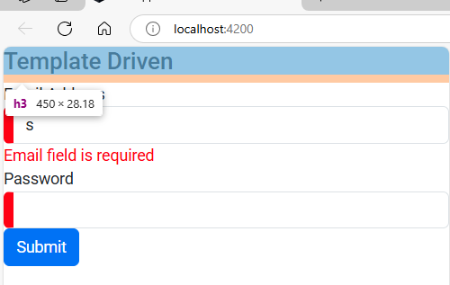

## 1. import `reactiveFormModule` in main module & add it to imports array.  
`app.module.ts`  
```Typescript
import { NgModule } from '@angular/core';
import { BrowserModule } from '@angular/platform-browser';
import { AppRoutingModule } from './app-routing.module';
import { AppComponent } from './app.component';

import { ReactiveFormsModule } from '@angular/forms';   // 🔄: here

@NgModule({
  declarations: [
    AppComponent,
  ],
  imports: [
    BrowserModule,
    AppRoutingModule,
    ReactiveFormsModule   // 🔄: here
  ],
  providers: [], 
  bootstrap: [AppComponent]
})
export class AppModule { }
```  

## 2. Add form markup  
`app.component.html`  
```html
<h3>Template Driven</h3>


<div class="col-sm-6">
    <form [formGroup]="loginForm" (ngSubmit)="collectData()">
        <div class="form-group">
            <label>Email Address</label>
            <input  type="email" class="form-control" name="email" formControlName="email">
        </div>
        <div class="form-group">
            <label>Password</label>
            <input  type="password" class="form-control" name="password" formControlName="password">
        </div>
        <button type="submit" class="btn btn-primary">Submit</button>
    </form>
</div>

<!-- [formGroup]="loginForm": one way binding from component.ts to component.html -->
<!-- Two-way binding ([(...)]) is used in template-driven forms, but not here. -->
<!-- formControlName="email" & formControlName="password" is connected to object key email & password inside FormGroup() method -->
<!-- email & password inputs are synced so changes in string paramenter reflects in UI  -->

<!-- This all one way binding flow is component => template -->
```  

## 3. Define functionality & validtions in component  
`app.component.ts`  
```Typescript
import { Component } from '@angular/core';
import { FormControl, FormGroup, Validators } from '@angular/forms';   // 🔄: here

FormControl


@Component({
  selector: 'app-root',
  templateUrl: './app.component.html',
  styleUrls: ['./app.component.scss']
})
export class AppComponent {

    // 🔄: login form function using FormGroup, inputbox using FormControl  
    loginForm = new FormGroup({
      email: new FormControl("", Validators.email), // 🔄: email validation  
      password: new FormControl("", Validators.required) // 🔄: not null validation  
    })

    collectData(){console.warn(this.loginForm.value)}
} 
```  
```html
            <input  type="email"  email>
            <!-- this email attribute will also work same the method from upper component.ts file -->
```  
here we applied some validation & we can see this, if we write unfinished email in email box & no password in password box. it shows `ng-invalid` attributes to those input boxes.  
##### Preview:  
  
as soon as we fill fields properly, the attribute will get changed to `ng-valid`  & we can apply css to indication of this  
  
`app.component.scss`  
```scss
input.ng-invalid{
    border-left: 10px solid red;
}
input.ng-valid{
    border-left: 10px solid green;
}
```  
  
  

## 4. Validation warning  
to give validation warning we have to 
1. `app.component.ts`  
```Typescript
import { Component } from '@angular/core';
import { FormControl, FormGroup, Validators } from '@angular/forms';   

@Component({
  selector: 'app-root',
  templateUrl: './app.component.html',
  styleUrls: ['./app.component.scss']
})
export class AppComponent {

    loginForm = new FormGroup({
      email: new FormControl("", Validators.email),  
      password: new FormControl("", Validators.required)   
    })

    get email(){
      return this.loginForm.get('email'); // 🔄: drilling current objects email by get method
    } 

} 
```  
2. `app.component.html`  
```html
<h3>Template Driven</h3>


<div class="col-sm-6">
    <form [formGroup]="loginForm">
        <div class="form-group">
            <label>Email Address</label>
            <input  type="email" class="form-control" name="email" formControlName="email">
            <span class="red-error" *ngIf="email.invalid && email.touched" >Email field is required</span>  <!-- 🔄: here -->
        </div>
        <div class="form-group">
            <label>Password</label>
            <input  type="password" class="form-control" name="password" formControlName="password">
        </div>
        <button type="submit" class="btn btn-primary">Submit</button>
    </form>
</div>

<!-- *ngIf="email.invalid && email.touched": means that span will only appears only after input box is clicked & email is invaliad -->
```  
now we can make this span message more stnad out by applying red css to it:  
3. `app.component.scss`  
```scss
input.ng-invalid{
    border-left: 10px solid red;
}
input.ng-valid{
    border-left: 10px solid green;
}

// 🔄
span.red-error{
    color: red;
}
```  
##### Preview:  
  

