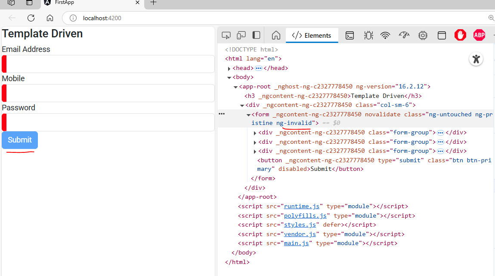

*- Template Driven  
## 1. import `FormsModule` add it to imports array in main module  
## 2. define `onSubmit()` method in component  
`app.component.ts`  
```Typescript
import { Component } from '@angular/core';

@Component({
  selector: 'app-root',
  templateUrl: './app.component.html',
  styleUrls: ['./app.component.scss']
})
export class AppComponent {
  onSubmit(data){
    console.warn(data);
  }
} 
```  
## 3. 
`app.component.html`  
```html
<h3>Template Driven</h3>

<div class="col-sm-6">
    <form #userForm="ngForm" >
        <div class="form-group">
            <label>Email Address</label>
            <input type="email" class="form-control" name="email"
            ngModel #email="ngModel" 
            required email
            >
            <span class="red-error" *ngIf="email.invalid && email.touched" >Enter valid Email</span>
        </div>
        <div class="form-group">
            <label>Mobile</label>
            <input  type="text" class="form-control" name="mobile" 
            ngModel #mobile="ngModel"
            required minlength="8" maxlength="12" pattern="[0-9]*"
            >
            <span class="red-error" *ngIf="mobile.invalid && mobile.touched" >Enter valid Mobile</span>
        </div>
        <div class="form-group">
            <label>Password</label>
            <input  type="password" class="form-control" name="password" 
            ngModel #password="ngModel"
            required password minlength="5" maxlength="10"
            >
            <span class="red-error" *ngIf="password.invalid && password.touched" >Enter valid Password</span>
        </div>
        <button type="submit" class="btn btn-primary" (click)="onSubmit(userForm.value)"
        [disabled]="userForm.invalid"
        >Submit</button>
        
    </form>
</div>
```  
`app.component.scss`  
```scss
input.ng-invalid{
    border-left: 10px solid red;
}
input.ng-valid{
    border-left: 10px solid green;
}

span.red-error{
    color: red;
}
```  
## Explaination:  
### 1. Input Validations   
#### A. Email validations:  
- required: must be filled  
- email: applied buit it mail regex  
#### B. Mobile validations:  
- required: must be filled  
- minlength="8": minimum length should be 8  
- maxlength="12": maximus length should be 12, after this no input will be accepted  
#### C. Password validations:  
- required: must be filled  
- minlength="5": minimum length should be 5  
- maxlength="10": maximus length should be 10, after this no input will be accepted  

### 2. Span appearance:
- all spans has class red-error
- we applied css to that class
- this class has condition to get active only (if input is invalid + clicked)   


### 3. Form & Button relation  
the form will have `ng-invalid` (invalid state) automatically if the either one of the input inside it is invalid  
- we diabled button as long the form is invalid  
##### Preview:  
  
- as soon as all input are satisfied (ng-valid attibute) the form will no longer invalid & the submit button removes disabled.  