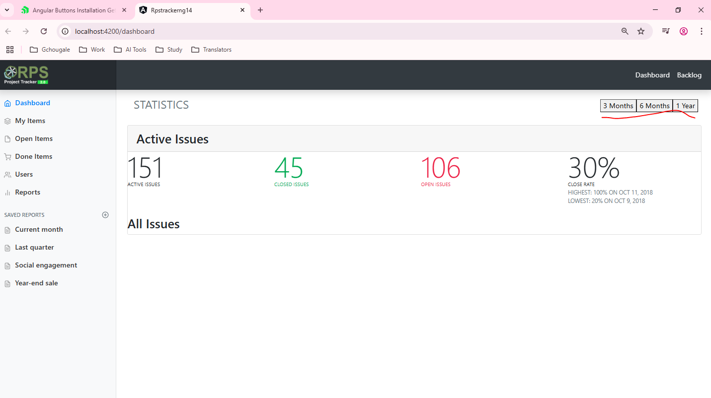
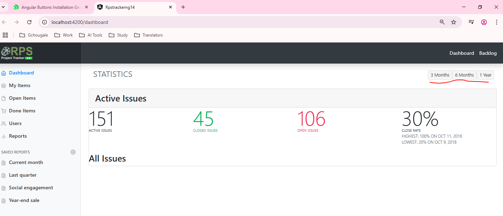

just into button installation guide  
`https://www.telerik.com/kendo-angular-ui/components/buttons/installation/manual-setup`  
here is manual installation    
```sh
npm install --save @progress/kendo-angular-buttons @progress/kendo-angular-l10n @progress/kendo-angular-popup @progress/kendo-angular-common @progress/kendo-licensing
```  
or use automatic installation  
```sh
ng add @progress/kendo-angular-buttons
```  

use automatic method for ease but after either command update the node_modules with  
```sh
npm i
```  
& then run the application  
```sh  
ng serve -o
```  
##### Preview:  
  
here we can see those buttons are simple, we need to apply `KendoButton` to them  
`rpstrackerng\src\app\modules\dashboard\dashboard.module.ts`  
here we need to import `ButtonModule` first & then append it to imports array  
```typescript
import { ButtonModule } from '@progress/kendo-angular-buttons';
```  
```typescript
    imports: [
        CommonModule,
        DashboardRoutingModule,
        SharedModule,
        ButtonModule // 🔄: here
    ],
```  
then use `kendoButton` directive into those buttons  
`rpstrackerng\src\app\modules\dashboard\pages\dashboard\dashboard.page.component.html`  
```typescript
        <div class="btn-toolbar mb-2 mb-md-0">
            <div class="btn-group mr-2">
                <button kendoButton type="button" (click)="onMonthRangeTap(3)">3 Months</button>
                <button kendoButton type="button" (click)="onMonthRangeTap(6)">6 Months</button>
                <button kendoButton type="button" (click)="onMonthRangeTap(12)">1 Year</button>
            </div>
        </div>
```  
##### Preview:  
  
