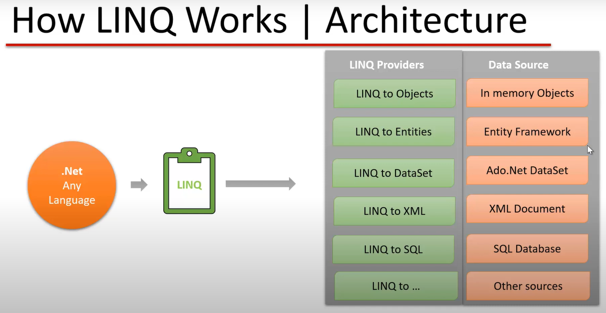

How LINQ a single query work for all data sources   
  
this is possible because  
A LINQ provider is software that implements the `IQueryProvider` and `IQueryable` interfaces for a particular data store.      
LINQ is included by default with DOTNET. It is part of the `System.Linq` namespace, which is automatically available in most .NET projects, including Console Applications, ASP.NET Core, and more.