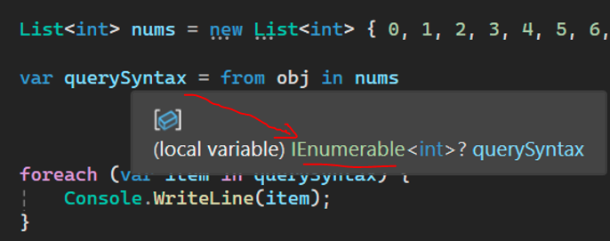

# `IEnumerable`  
```C#
            List<int> nums = new List<int> { 0, 1, 2, 3, 4, 5, 6, 7, 8, 9 };

            var querySyntax = from obj in nums
                              where obj > 5
                              select obj;

            foreach (var item in querySyntax) {
                Console.WriteLine(item);
            }
```  
here if we hover on var variable, it says it is a IEnumerable type.  
  
so if we replace the `var querySyntax` with `IEnumerable<int> querySyntax` it will work just as fine.  
```C#
            List<int> nums = new List<int> { 0, 1, 2, 3, 4, 5, 6, 7, 8, 9 };

            IEnumerable<int> querySyntax = from obj in nums
                              where obj > 5
                              select obj;

            foreach (var item in querySyntax) {
                Console.WriteLine(item);
            }
```  
- IEnumerable is an interface which is available in `System.Collection` namespace.  
- All the collection in C# implements IEnumerable.  
- this interface is type of iteration design pattern, & IEnumerable interface we can interate (like foreach loop) on collections.  
- IEnumerable also has a child for generic classes-IEnumerable<T>  

Example:
```C#
using System;

namespace MyApp {
    internal class Program {
        static void Main(string[] args) {

            List<Employee> employeees = new List<Employee> {
                new Employee(){id=1, name="Ramesh"},
                new Employee(){id=2, name="Suresh"}
            };

            IEnumerable<Employee> query = from emp in employeees
                                          where emp.id == 1
                                          select emp;

            foreach(var parameter in query) {
                Console.WriteLine("Id: " + parameter.id + " Name: "+ parameter.name);
            }

            Console.ReadLine();

        }
    }

    class Employee {
        public int id { get; set; }
        public string name { get; set; }
    }
}
```  
#### output:
```terminal
Id: 1 Name: Ramesh
```  
# `IQuerable`  
IQuerable is an interface available in `System.Linq` namespace  
IQuerable is child of IEnumerable.  
IQuerable has a property `Provide` which is of type `IQuerableProvider` interface, and it is used in LinqProviders.
IQuerable is best choice for other data provider (LINQ to Entities, LINQ to XML... etc).
Example
```C#
using System;

namespace MyApp {
    internal class Program {
        static void Main(string[] args) {

            List<Employee> employeees = new List<Employee> {
                new Employee(){id=1, name="Ramesh"},
                new Employee(){id=2, name="Suresh"}
            };

            IQueryable<Employee> query1 = employeees.AsQueryable().Where(x=>x.id==1);

            foreach(var parameter in query1) {
                Console.WriteLine("Id: " + parameter.id + " Name: "+ parameter.name);
            }

            Console.ReadLine();
        }
    }

    class Employee {
        public int id { get; set; }
        public string name { get; set; }
    }
}
```  
#### output:
```terminal
Id: 1 Name: Ramesh
```  

# `IEnumerable` Vs `IQuerable` summery:   
### IEnumerable or IEnumerable<T> are highly recomended for in memory data objects.  
### IQuerable are highly recomended for  external data sources.  

